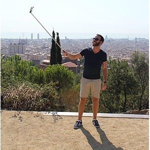
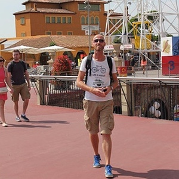
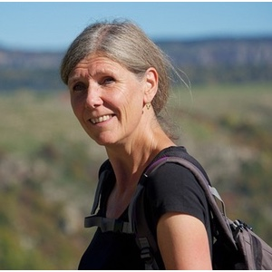
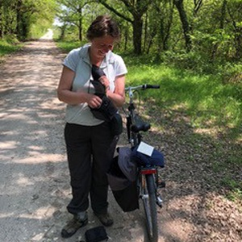

{::options parse_block_html="true" /}

### Johan de Meij

_Voorzitter sinds 2010_

Geboren in Arnhem, getrouwd met Hélène, drie kinderen en één kleinkind. Houdt van sporten (bridge), doe-het-zelven en andere helpen. Neemt soms teveel hooi op zijn vork, maar wil nu eenmaal overal wat van maken. Geniet van het Franse _joie de vivre_ en eet graag _Gardianne de taureau_. Is graag in zijn achtertuin.
Zorgen dat de NVM een vereniging blijft waarin Nederlandsetaligen in Montpellier en omgeving zich thuisvoelen

### Nanneke Mara

_Secretaris sinds 2016_

Geboren in Zeist, twee zoons, werkt met veel plezier als psychiatrisch verpleegkundige bij de CHU. Is daar ook vrijwillig tolk. Bezoekt eveneens als vrijwilliger Nederlanders in Franse gevangenissen. Houdt van fietsen, lezen, zingen, reizen. Waardeert de fijne Franse keuken en haar mooie leefomgeving, eet dus graag in één van de restaurantjes in de kleine straatjes in de binnenstad. Zorgzaam voor de medemens. Gezellige momenten met landgenoten organiseren.

### Ronald Oomen

_Penningmeester sinds 2015_

Geboren in Ettenleur, getrouwd met Ruurd. Celbioloog bij Vilmorin, producent in groentenzaden. Houdt van wandelen, lekker eten (als er maar foie gras inzit), bioscoop en op het strand liggen. Vindt het mooi dat de Franse trots zijn op hun land, cultuur en gebruiken (niks chauvinistisch). Gaat graag naar Jardin de Peyrou, vooral op zondagmorgen als er brocante is. Is eigenwijs, maar ook optimistisch. Mijn steentje bijdragen aan de organisatie van activiteiten voor jong en oud.

### Ton Verstoep

_Lid sinds 2010_

Geboren in Rotterdam, weduwnaar, één dochter, één zoon en drie kleinkinderen. Oprichter en ex-voorzitter van de NVM. Heeft het druk met van alles o.a. golven en wandelen. Gaat graag naar de dierentuin en Odysseum. Waardeert de goede manier van de Fransen. Eet graag gevulde kwartel met creme en champignons. Zwakke punt: "zijn leeftijd", sterke punt: "sociaal gevoel". Hoopt nog 2 jaar door te gaan bij de NVM.

### Ruurd Leveling

_Lid sinds 2015_

Geboren in Schoonebeek, getrouwd met Ronald. Commercieel medewerker bij Lab Chauvin/Bausch+Lomb. Hobbies muziek, lezen, reizen. Waardeert de eigenzinnige Fransen en een heerlijke magret de canard. Is graag thuis met een glaasje wijn... Positief ingesteld, gevoel voor humor. Organisatie en ondersteuning van diverse activiteiten.

### Mieke Kriens

_Lid sinds 2017_

Geboren in Zaandam, getrouwd met Peter, moeder van een dochter en een zoon. Eigenaar van [www.onderwijs.fr](http://www.onderwijs.fr), de website over Nederlandse les in Frankrijk. Houdt van wandelen, lezen en koken. Geniet van het Franse leven, de cultuur en de _cuisine_! Kan goed organiseren. Wil graag Nederlandse culturele activiteiten organiseren.

### Elsien van Galen

_Lid sinds 2017_

Geboren in Ede. Flink over de wereld gezworven (Groningen, London, Kiribati, China, Nepal, India, en nu Montpellier) met een Schotse partner. Heeft veel banen gehad en studies gevolgd: studie Frans, docente/examinatrice Engels, master kunst, en master geschiedenis. Daarnaast moeder en grootmoeder. Inmiddels _halftime_ gepensioneerd om te kunnen zwemmen, yoga, wandelen, fietsen, pianospelen, Italiaans leren en toneel spelen.

### Jan Pit

_Lid sinds 2013_

Geboren in Teijlingen (Sassenheim). Met Marijke ruim 40 jaar in Afrika gewerkt (Algerije, Madagascar, Kenia, Centraal-Afrika, Botswana). Natuurkunde, statistiek, schakeltechniek, en informatica. Twee zonen en vier kleinkinderen. Sinds 2013 in Frankrijk (Lattes). Wandelt graag in de ruime omgeving. Computert veel, geïnteresseerd in genealogie. Geniet van het Franse leven in al zijn facetten.

## Rosalie Schlatmann

_Lid sinds 2018_

Geboren in Veghel, getrouwd met Marcus, hebben samen een _garçon et fille_. Houdt van fietsen, wandelen, lezen, natuur en oude muziek. Brengt veel tijd door in de keuken zowel kokend als etend met een goed glas wijn! Altijd op zoek naar pure en eerlijke ingredienten. Woont sinds 1995 in de regio Beziers, maar vertoeft ook graag in de Alpen en de Vienne. Draagt graag een steentje bij aan de activiteiten van de NVM, ondanks de wat grotere afstand.

