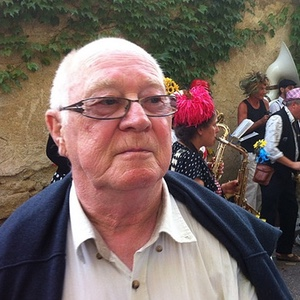

{::options parse_block_html="true" /}

### Johan de Meij

_Voorzitter sinds 2010_

Geboren in Arnhem, getrouwd met Hélène, drie kinderen en één kleinkind. Houdt van sporten (bridge), doe-het-zelven en andere helpen. Neemt soms teveel hooi op zijn vork, maar wil nu eenmaal overal wat van maken. Geniet van het Franse _joie de vivre_ en eet graag _Gardianne de taureau_. Is graag in zijn achtertuin.
Zorgen dat de NVM een vereniging blijft waarin Nederlandsetaligen in Montpellier en omgeving zich thuisvoelen

### Nanneke Mara

_Secretaris sinds 2016_

Geboren in Zeist, twee zoons, werkt met veel plezier als psychiatrisch verpleegkundige bij de CHU. Is daar ook vrijwillig tolk. Bezoekt eveneens als vrijwilliger Nederlanders in Franse gevangenissen. Houdt van fietsen, lezen, zingen, reizen. Waardeert de fijne Franse keuken en haar mooie leefomgeving, eet dus graag in één van de restaurantjes in de kleine straatjes in de binnenstad. Zorgzaam voor de medemens. Gezellige momenten met landgenoten organiseren.

### Ton Verstoep

_Lid sinds 2010_

Geboren in Rotterdam, weduwnaar, één dochter, één zoon en drie kleinkinderen. Oprichter en ex-voorzitter van de NVM. Heeft het druk met van alles o.a. golven en wandelen. Gaat graag naar de dierentuin en Odysseum. Waardeert de goede manier van de Fransen. Eet graag gevulde kwartel met creme en champignons. Zwakke punt: "zijn leeftijd", sterke punt: "sociaal gevoel". Hoopt nog 2 jaar door te gaan bij de NVM.

### Jan Pit

_Penningmeester sinds 2023_

Geboren in Teijlingen (Sassenheim). Met Marijke ruim 40 jaar in Afrika gewerkt (Algerije, Madagascar, Kenia, Centraal-Afrika, Botswana). Natuurkunde, statistiek, schakeltechniek, en informatica. Twee zonen en vier kleinkinderen. Sinds 2013 in Frankrijk (Lattes). Wandelt graag in de ruime omgeving. Computert veel, geïnteresseerd in genealogie. Geniet van het Franse leven in al zijn facetten.

